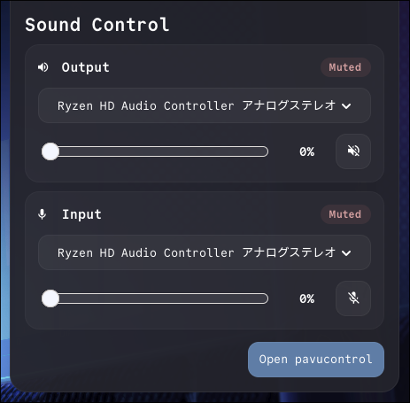

# sound-control-popup

`sound-control-popup` is a small GTK4 + layer-shell popup for Wayland audio controls.

It targets PipeWire environments that expose `wpctl` and `pactl`, and is intended for setups that want a lightweight popup near Waybar instead of a full mixer window.

## Screenshot



## Features

- Output and input sections in a single popup
- Default sink/source switching via `pactl`
- Volume and mute controls via `wpctl`
- Optional shortcut button to open `pavucontrol`
- Layer-shell overlay behavior for Wayland desktops

## Requirements

- Linux with Wayland
- GTK4 development libraries
- `gtk4-layer-shell`
- PipeWire / WirePlumber tools:
  - `wpctl`
  - `pactl`
- Optional:
  - `pavucontrol`
  - Nerd Font for the icon glyphs used in the UI

## Build

```bash
cargo build --release
```

## Install

1. Install Rust plus the GTK4 and layer-shell development packages from your distribution.
2. Ensure the runtime commands `wpctl` and `pactl` are available in `PATH`.
3. Optionally install `pavucontrol` if you want the footer button to launch it.
4. Build and install the binary:

```bash
cargo install --path .
```

## Run

```bash
cargo run --release
```

The app uses the GTK application id `io.github.rikunamiki.sound_control_popup` and the layer-shell namespace `io.github.rikunamiki.sound-control-popup`. It opens as an overlay near the top-right edge of the screen.

## Notes

- The project is intentionally Linux/Wayland-specific.
- Errors from external audio commands are surfaced to stderr and reflected in the UI instead of silently degrading to fake values.
- Device parsing is based on the current `pactl list sinks` / `pactl list sources` text format. Tests cover the parsing logic, but distributions with heavily patched output may still need adjustments.

## Development

```bash
cargo fmt
cargo clippy --all-targets --all-features -- -D warnings
cargo test
```

CI runs the same checks on pushes and pull requests.

## License

MIT-0. You can use, modify, redistribute, and sell this software with no attribution requirement. It is provided as-is, without warranty or liability.
